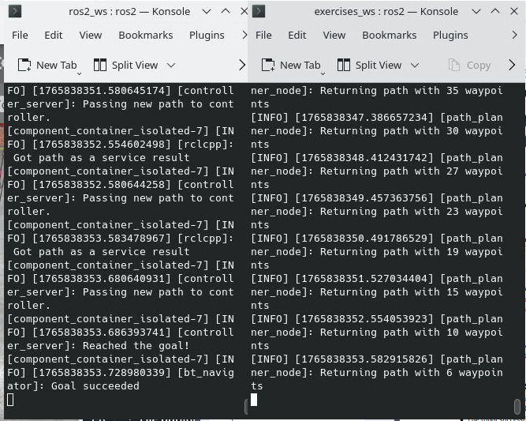
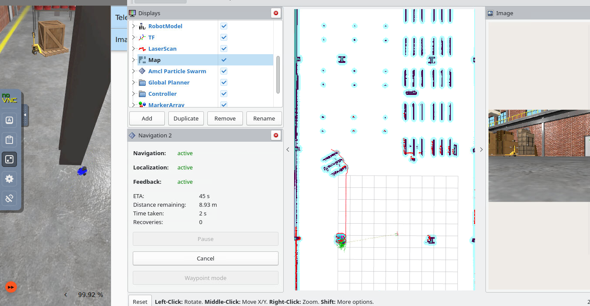

# 🚀 Robust Path Planning for  Andino Robot Using A* Algorithm

**Author:** Luel A.  
📧 luelgeb@uef.fi  

---

## 📌 Overview

This project presents a **robust global path planning solution** for the **Andino mobile robot**, implemented in **ROS 2** using the **A\*** search algorithm.

The default straight-line planner was replaced with a **custom A\*** planner capable of generating **collision-free, smooth paths** on a grid-based occupancy map. Compared to the original planner, this approach enables reliable navigation in **cluttered environments**, significantly improving path quality and execution stability.

---

## 🎥 Video Demonstration

[](media/demo.webm)

> Click the GIF above to watch the full simulation video (.webm format)

**The video demonstrates:**
- Occupancy grid map loading
- A* path planning in RViz
- Obstacle-aware navigation
- Smooth robot motion in Gazebo
- Terminal output of interpolated waypoints

---

## 🧠 Key Features

- ✅ Custom **A\*** global planner (replacing `NavfnPlanner`)  
- ✅ Grid-based planning using `OccupancyGrid`  
- ✅ Obstacle avoidance with **implicit safety margin**  
- ✅ Smooth waypoint interpolation (0.2 m spacing)  
- ✅ Fully integrated into the **ROS 2 navigation framework**  
- ✅ Validated in **RViz + Gazebo simulation**

---

## 🧭 Methodology

The planner is implemented as a **custom global planner** within ROS 2. It subscribes to the global occupancy grid map (`/map`) and provides a `create_plan` service to generate paths on demand.

### 🔹 A* Path Planning

The A* algorithm evaluates nodes using the cost function:

\[
f(n) = g(n) + h(n)
\]

Where:

- \( g(n) \) is the cost from the start node to the current node  
- \( h(n) \) is the **Euclidean distance** from the current node to the goal:

\[
h(n) = \sqrt{(x_g - x_n)^2 + (y_g - y_n)^2}
\]

Additional details:

- Uses an **8-connected grid**, allowing diagonal motion  
- Evaluates neighbors by combining \( g(n) \) and \( h(n) \)  
- Generates an optimal or near-optimal path while avoiding obstacles


---

## 🛡️ Obstacle Avoidance with Safety Margin

Instead of validating only the target grid cell, the planner checks the **8-connected neighborhood** of each cell.  
This creates an **implicit safety buffer**, ensuring paths do not pass too close to obstacles.

### 🔍 Example: Path turning away from an obstacle


---

## ✨ Path Smoothing via Waypoint Interpolation

The raw A* output is grid-based and may contain sharp turns. To improve motion quality:

- Linear interpolation is applied between consecutive grid cells  
- Waypoints are spaced at approximately **0.2 m**  
- The interpolated sequence is logged in the terminal

### 🧾 Terminal Output Example


This results in **smooth, stable trajectories** suitable for real robot execution.

---

## 🧪 Experimental Results

Simulations were conducted in **Gazebo**, visualized in **RViz**.

### ✅ Observations
- The robot consistently avoided static obstacles  
- Alternative routes were found when direct paths were blocked  
- Path length decreased smoothly as the robot approached the goal  
- No collisions were observed  
- Motion execution was smooth and reliable

### 🖼️ Combined RViz + Gazebo View


---

## 📂 Repository Structure
Robotics-and-XR-project/
├── ros2_ws/         # Custom A* planner and navigation setup
├── exercises_ws/    # Path planner nodes and exercises
└── media/           # GIFs, screenshots, and simulation videos

## ⚙️ How to Run

```bash
# Build workspace
cd ros2_ws
colcon build
source install/setup.bash

# Launch Andino robot simulation
ros2 launch andino_custom andino_gz.launch.py

# Build workspace
cd exercises_ws
colcon build
source install/setup.bash
# launch the PathPlannerNode in another terminal
ros2 run path_planner_example path_planner_node --ros-args -p use_sim_time:=True
